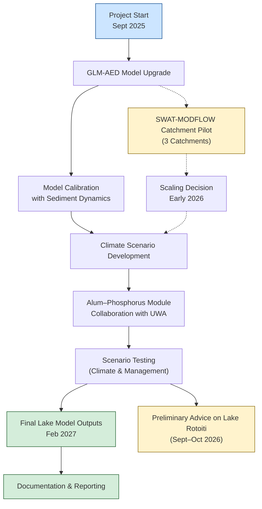

# Rotorua Lake Modelling – PC10 Support

The Rotorua Lake model will be updated to [**GLM-AED**](https://aquatic.science.uwa.edu.au/research/models/AED/), an open-source hydrodynamic–ecological model that enables improved simulation of vertical mixing, nutrient cycling, and management interventions under variable climate conditions.

This upgrade will allow long-term scenario testing and a more flexible, modular architecture.

------------------------------------------------------------------------

## 🔍 Overview

Key enhancements over previous Lake Rotorua models will include:

-   **Dynamic sediment–water feedback** to better represent internal nutrient loading and delayed responses to external inputs.\
-   **Support for climate change scenarios**, enabling projections of lake responses over decadal scales.\
-   **Mechanistic simulation of alum dosing**, which is currently conducted in two inflows on a near-daily basis.\
-   **Active and ongoing development** of model software and related tools.

------------------------------------------------------------------------

## ⚗️ Alum–Phosphorus Modelling

One important improvement will be incorporating a **mechanistic representation of Al–P interactions**.\
Current models do not explicitly simulate alum chemistry or its interaction with phosphorus.

We are engaging with the **University of Western Australia (UWA)** to explore support for code modification within the AED structure.

The proposed model will simulate:

-   Hydrolysis of dosed alum and speciation of aluminium (e.g. *Al³⁺*, *Al(OH)₃*)\
-   pH and temperature dependence of phosphate binding efficiency\
-   Sediment-mediated sorption and variable effectiveness depending on depth, organic content, and redox state\
-   Aging or decay of reactive Al over time to simulate persistence of alum effects\
-   Dosing through inflow boundary conditions, allowing for flexible scenario testing

> If this collaboration is not confirmed, alternate pathways for implementing alum dynamics will be explored to maintain model delivery timelines.

------------------------------------------------------------------------

## 🗓️ Timeline and Resources

-   The model upgrade and calibration will **begin in September 2025**, using existing University of Waikato resources.\
-   **Initial climate change scenarios** will be prioritised and delivered by **September 2026**, with alum scenario testing dependent on code development.\
-   This lake modelling work will **proceed independently of catchment model scaling**, ensuring continuity regardless of SWAT-MODFLOW outcomes.

------------------------------------------------------------------------

## 📅 Deliverables and Milestones

| Milestone | Target Date | Deliverable |
|----------------------|--------------------------|------------------------|
| **SWAT-MODFLOW pilot (3 catchments)** | March 2026 | Calibrated sub-catchment models and model evaluation |
| **GLM-AED model upgrade** | March 2026 | Lake model calibrated with sediment dynamics |
| **Scaling decision – catchment model** | Early 2026 | Evaluation and planning for full-catchment rollout |
| **Initial climate scenarios for lake** | September 2026 | Long-term projections under climate change (inclusion of catchment scenarios contingent on scaling decision) |
| **Preliminary advice re Rotoiti** | September–October 2026 | Advice on potential downstream impacts (if Ōhau Wall is repaired) |
| **Complete lake model and scenario delivery** | February 2027 | Finalised lake model outputs including full climate and management scenario set; documentation and reporting |

------------------------------------------------------------------------

## 🧭 Other Considerations

The proposed work is **strongly aligned with PC10 implementation**.\
Council staff have highlighted the need for **early advice on potential changes in nutrient delivery to Lake Rotoiti**, particularly if the Ōhau Wall is repaired.

This advice — ideally delivered by **September or October 2026** — may be supported by the updated lake model and preliminary catchment scenario runs (depending on the outcome of the pilot).

------------------------------------------------------------------------

## 🧱 Repository Structure (for development)

If this repository will include R modelling workflows (e.g. using the [`targets`](https://docs.ropensci.org/targets/) package), a recommended structure is:

## 🧭 Project Workflow Overview

The following diagram summarises the key phases, dependencies, and outputs of the Rotorua Lake Modelling project.

