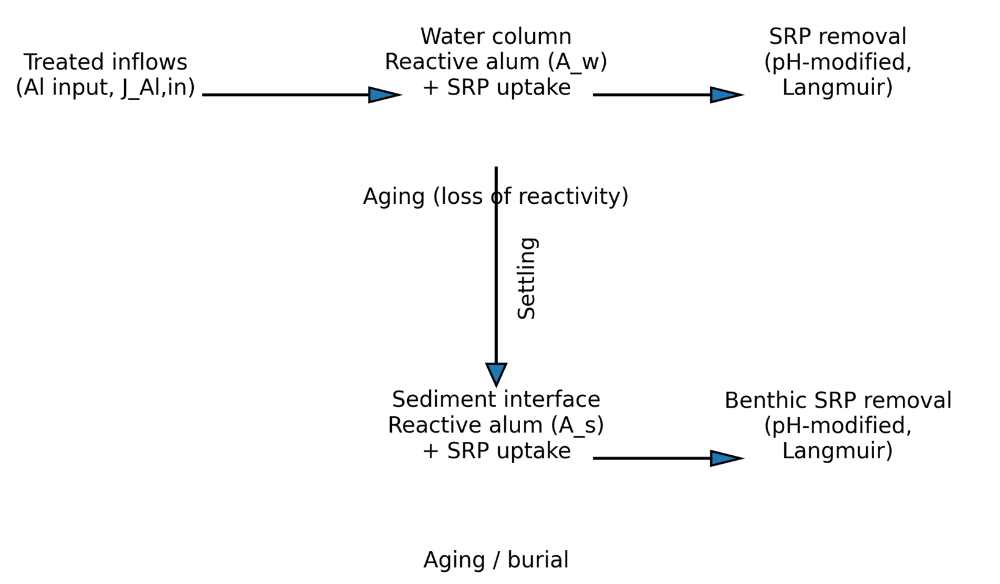
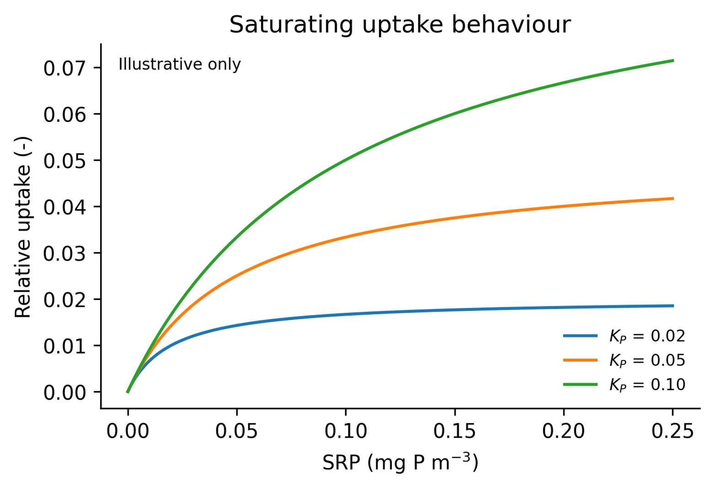
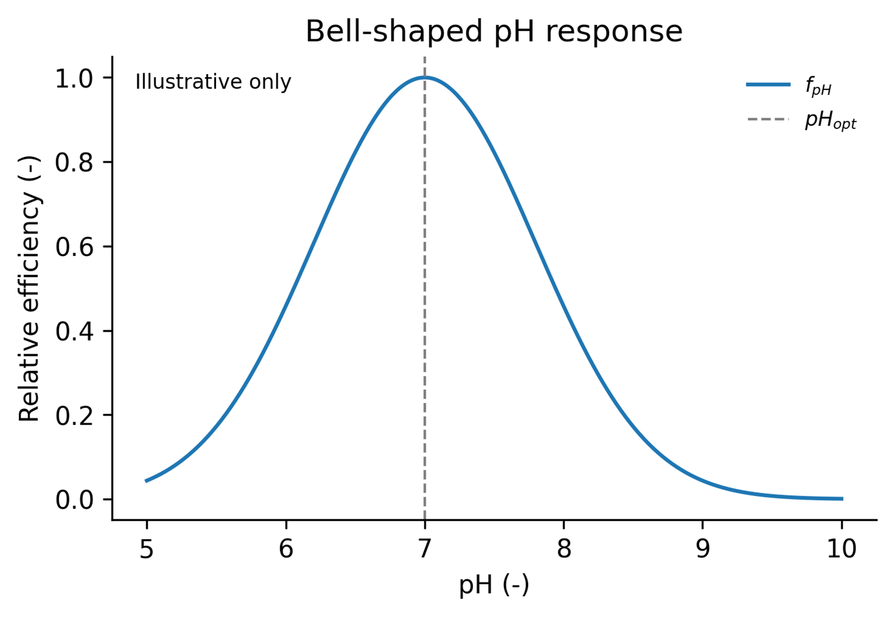

# Alum–phosphorus process representation for GLM-AED application in Lake Rotorua

::: {.callout-note}

## Summary

This document summarises a simple process representation of alum–phosphorus interactions for integration into GLM-AED. The formulation is intended to capture the main management-relevant processes in Lake Rotorua:

-   alum delivery from treated inflows,
-   SRP uptake in the water column,
-   settling of remaining reactive material,
-   continued uptake at the sediment–water interface,
-   a gradual loss of reactivity through ageing, and
-   a bell-shaped pH response included as a pragmatic modifier of binding efficiency.

:::

## Conceptual process diagram

The schematic below shows how the simplified module fits together. Treated inflows add effective reactive capacity to the pelagic pool, which removes SRP while suspended. Remaining capacity then settles to the bed, where it continues to suppress SRP in the bottom layer. Ageing reduces reactivity in both compartments.

{fig-align="center"}

## Core equations

### Equation 1. Water-column SRP uptake

Reactive suspended alum capacity in the water column, $C_w$ (mg P m^−3^), removes dissolved reactive phosphorus, SRP (mg P m^−3^). The uptake rate is controlled by a pelagic kinetic coefficient, $k_w$ (d^−1^), the pH modifier, $f_\text{pH}$ (−), and a saturating uptake term governed by $K_P$ (mg P m^−3^). The saturating form ensures uptake increases with SRP but levels off as SRP becomes small relative to $K_P$.

$$
\frac{d\mathrm{SRP}}{dt} = -k_w f_\mathrm{pH} C_w \frac{K_P\,\mathrm{SRP}}{K_P + \mathrm{SRP}}
$$ {#eq-srp-wc}



### Equation 2. Water-column reactive capacity

The pelagic reactive-capacity pool, $C_w$ (mg P m^−3^), increases with alum input from the treated inflows, represented by $J_\text{cap}$ (mg P d^−1^), and decreases through three pathways: SRP uptake, settling to the bed, and ageing. The volume term, $V$ (m^3^), converts inflow capacity into a concentration-based state variable. $J_\text{set}$ (mg P m^−3^ d^−1^) is the settling loss from the water column, while $k_{\text{age},w}$ (d^−1^) controls the exponential decline in pelagic reactivity.

$$
\frac{dC_w}{dt} = \frac{J_\mathrm{cap}}{V} - k_w f_\mathrm{pH} C_w \frac{K_P\,\mathrm{SRP}}{K_P + \mathrm{SRP}} - J_\mathrm{set} - k_{\mathrm{age},w}\,C_w
$$ {#eq-cw}

### Equation 3. Bottom-water SRP uptake

Once alum settles, the remaining reactive capacity at the bed, $C_s$ (mg P m^−2^), continues to remove SRP from the bottom computational layer, $\text{SRP}_b$ (mg P m^−3^). The benthic uptake rate is controlled by $k_s$ (d^−1^), the same pH modifier, and the same saturating uptake term. The factor $1/h_b$ converts an areal benthic sink into a concentration change in the bottom water layer of thickness $h_b$ (m).

$$
\frac{d\mathrm{SRP}_b}{dt} = -\frac{1}{h_b}\,k_s f_\mathrm{pH} C_s \frac{K_P\,\mathrm{SRP}_b}{K_P + \mathrm{SRP}_b}
$$ {#eq-srp-bed}

### Equation 4. Sediment reactive capacity

The benthic reactive-capacity pool, $C_s$ (mg P m^−2^), increases through settling input from the pelagic compartment, $J_\text{set}^\text{area}$ (mg P m^−2^ d^−1^), and decreases through bottom-water uptake, ageing, and burial or permanent isolation from exchange. The terms $k_{\text{age},s}$ (d^−1^) and $k_\text{bur}$ (d^−1^) therefore represent two separate loss pathways: gradual deactivation of reactivity and physical removal from the active sediment–water interface, respectively.

$$
\frac{dC_s}{dt} = J_\mathrm{set}^\mathrm{area} - k_s f_\mathrm{pH} C_s \frac{K_P\,\mathrm{SRP}_b}{K_P + \mathrm{SRP}_b} - k_{\mathrm{age},s}\,C_s - k_\mathrm{bur}\,C_s
$$ {#eq-cs}

### Equation 5. Bell-shaped pH response

The pH modifier, $f_\text{pH}$ (−), is represented as a bell-shaped response centred on the optimal pH, $\text{pH}_\text{opt}$ (−). The parameter $\sigma_\text{pH}$ (−) controls the width of the response. This is not a full chemical equilibrium model; it is a practical way of reducing effective uptake when pH moves away from the range where alum is expected to bind phosphorus most efficiently.

$$
f_\mathrm{pH} = \exp\!\left[-\frac{(\mathrm{pH} - \mathrm{pH_{opt}})^2}{2\,\sigma_\mathrm{pH}^2}\right]
$$ {#eq-fph}



### Equation 6. Exponential ageing

Ageing is represented as a first-order exponential loss of reactivity. Here, $A(t)$ denotes the remaining reactive fraction at time $t$ and $A_0$ is the initial reactive fraction. For the current implementation, the ageing parameter is chosen so that 95% of reactive uptake capacity is lost after 30 days. This gives $k_\text{age} \approx 0.10$ d^−1^. In practice, this same logic is applied to the pelagic and benthic ageing terms, $k_{\text{age},w}$ and $k_{\text{age},s}$.

$$
A(t) = A_0\,e^{-k_\mathrm{age}\,t} \qquad k_\mathrm{age} = -\frac{\ln(0.05)}{30} \approx 0.10 \ \mathrm{d}^{-1}
$$ {#eq-ageing}

## State variables and parameters

The table below lists the state variables, fluxes, and parameters used in the simplified model. All symbols referenced in the equations are included here so the document can be read either as a stand-alone concept note or as a guide for module implementation.

| **Symbol** | **Suggested units** | **Type** | **Interpretation** |
|------------------|------------------|------------------|------------------|
| SRP | mg P m^−3^ | State variable | Dissolved reactive phosphorus in the pelagic layer. |
| SRP~b~ | mg P m^−3^ | State variable | Bottom-water SRP concentration in the bottom computational layer. |
| C~w~ | mg P m^−3^ | State variable | Remaining effective P-binding capacity of suspended alum. |
| C~s~ | mg P m^−2^ | State variable | Remaining effective P-binding capacity of settled alum at the bed. |
| J~cap~ | mg P d^−1^ | Flux | Input rate of effective binding capacity from treated inflows. |
| V | m^3^ | Scaling term | Receiving layer volume used to convert inflow capacity to concentration. |
| J~set~ | mg P m^−3^ d^−1^ | Flux | Settling loss of reactive capacity from the water column. |
| J~set~^area^ | mg P m^−2^ d^−1^ | Flux | Areal settling input of reactive capacity to the bed. |
| h~b~ | m | Scaling term | Thickness of the bottom computational layer. |
| k~w~ | d^−1^ | Parameter | Pelagic kinetic coefficient controlling water-column uptake. |
| k~s~ | d^−1^ | Parameter | Benthic kinetic coefficient controlling bottom-water uptake. |
| K~P~ | mg P m^−3^ | Parameter | Saturating uptake parameter controlling low-SRP behaviour. |
| f~pH~ | − | Modifier | Relative efficiency term describing the pH effect on uptake. |
| pH~opt~ | − | Parameter | Optimal pH for alum–phosphorus uptake. |
| σ~pH~ | − | Parameter | Width of the bell-shaped pH response. |
| k~age,w~ | d^−1^ | Parameter | Pelagic ageing coefficient governing exponential loss of reactivity. |
| k~age,s~ | d^−1^ | Parameter | Benthic ageing coefficient governing exponential loss of reactivity. |
| k~bur~ | d^−1^ | Parameter | Burial or permanent isolation coefficient for settled reactive capacity. |
| A(t) | − | Derived quantity | Remaining reactive fraction after time t in the ageing function. |
| A~0~ | − | Derived quantity | Initial reactive fraction at t = 0 in the ageing function. |

: State variables, fluxes, and parameters {#tbl-params .striped}

## Notes for implementation

A practical first implementation in GLM-AED could introduce two new state variables: a pelagic reactive-capacity pool ($C_w$) and a benthic reactive-capacity pool ($C_s$). The main calibration priorities are likely to be the dose-to-capacity conversion ($J_\text{cap}$), the pelagic and benthic kinetic coefficients ($k_w$ and $k_s$), the settling transfer, and the pH response parameters. For ageing, the intended behaviour is simple exponential loss of reactivity rather than a more complex multi-pool formulation.

------------------------------------------------------------------------

# Feedback

## Kinetic formulation, AED units and notation

This document presents a simplified process representation of alum–phosphorus interactions for integration into GLM-AED as the module `aed_alum`. SRP uptake is represented as a **kinetic rate** process. Units, variable notation, and parameter conventions follow `aed_phosphorus` and the AED framework. A sediment resuspension term is included but disabled by default via a logical switch.

The module is intended to capture the main management-relevant processes for Lake Rotorua:

-   alum capacity delivery from treated inflows,
-   kinetic uptake of dissolved reactive phosphorus in the water column,
-   settling of remaining reactive material to the bed,
-   continued kinetic uptake at the sediment–water interface,
-   a gradual loss of reactivity through ageing,
-   optional resuspension of settled alum, and
-   a bell-shaped pH response as a pragmatic modifier of binding efficiency.

## Structural decisions and open questions
 
The formulation below resolves several structural issues identified while
reviewing the original concept note against the AED framework and the
`aed_phosphorus`, `aed_silica`, and `aed_tracer` modules. The items still
requiring confirmation are listed first.
 
### Open — still requiring a decision
 
- **Numerical behaviour of kinetic uptake.** SRP uptake is represented as a
  kinetic rate (Equation 1). Alum P-binding is physically fast, so a realistic
  `k_w` may be large enough to introduce stiffness and overshoot in an explicit
  ODE step. This needs to be checked in testing; if it proves unstable, the
  alternative is an equilibrium partition computed in an `equilibrate` routine,
  as `aed_phosphorus` does for adsorption.
- **Does ageing release or trap bound phosphorus?** Ageing reduces binding
  capacity, but whether it also releases already-bound P depends on the physical
  interpretation — occlusion (P trapped) versus floc dissolution (P returned to
  `frp`). The "trapped" interpretation is adopted here (no ageing term on the
  bound pools), but should be confirmed against data from Lake Rotorua.
- **Alum delivery mechanism.** Delivering alum capacity by dividing an inflow
  load by a fixed receiving-layer volume is fragile, because GLM places inflows
  by density and the receiving layer changes over time. The recommended approach
  is to deliver alum as an inflow water-quality concentration and let GLM
  distribute it, retaining the explicit `S_ala` term only for direct dosing.
  This needs to be confirmed against how GLM-AED handles inflow WQ variables.

### Resolved in this formulation
 
- **Phosphorus mass closure.** Phosphorus removed from `frp` is tracked in
  explicit bound-P pools (`alp`, `ben_alp`) rather than disappearing from the
  budget.
- **Settling as one coupled flux.** Settling is handled by the `mobility`
  routine and AED transport, not as separate hand-coded volumetric and areal
  terms.
- **Benthic pools as sheet variables.** `ben_ala` and `ben_alp` are registered
  with `aed_define_sheet_variable`. This deliberately extends beyond the
  `aed_phosphorus` template, which carries no benthic adsorbed-P state variable.
- **pH dependency.** pH is sourced from `aed_carbon` (`CAR_pH`), with a
  configurable variable name and an `f_pH = 1` fallback when unavailable.
- **Units and rate conventions.** Phosphorus is in mmol P m⁻³ / m⁻², matching
  `frp`; namelist rates are per-day and converted to per-second on read.
- **Bottom-water SRP.** Bottom-water SRP is `frp` evaluated in the bottom layer,
  not a separate state variable.
- **Resuspension.** An optional, switch-gated resuspension term is included
  (Equation 7), disabled by default.


## Notation and unit conventions

-   Phosphorus concentrations are in **mmol P m⁻³** (pelagic) or **mmol P m⁻²** (benthic), consistent with `aed_phosphorus`. Where alum delivery is quoted as a mass dose, convert using a molar mass of P of 30.97 g mol⁻¹.
-   All rate parameters are supplied in the namelist **per day** and converted to **per second** on read in `aed_define_alum` (division by `secs_per_day`), following the AED convention.
-   Settling velocity `w_ala` is supplied in **m day⁻¹** and converted to **m s⁻¹** on read.
-   Fluxes applied to `frp` are in mmol P m⁻³ s⁻¹ (pelagic) or mmol P m⁻² s⁻¹ (benthic).
-   The equations below are written with rates in per-day units for readability; the implementation uses the per-second equivalents.

## State variables

| Variable | AED name | Units | Compartment | Registration | Interpretation |
|------------|------------|------------|------------|------------|------------|
| FRP | `frp` | mmol P m⁻³ | Pelagic | external link | Filterable reactive phosphorus, owned by `aed_phosphorus`; located, not redefined. |
| Suspended alum capacity | `ala` | mmol P m⁻³ | Pelagic | `aed_define_variable` | Remaining effective P-binding capacity of suspended alum, expressed as bindable P. |
| Suspended alum-bound P | `alp` | mmol P m⁻³ | Pelagic | `aed_define_variable` | Phosphorus bound to suspended alum. |
| Settled alum capacity | `ben_ala` | mmol P m⁻² | Benthic | `aed_define_sheet_variable` | Remaining effective P-binding capacity of settled alum at the bed. |
| Settled alum-bound P | `ben_alp` | mmol P m⁻² | Benthic | `aed_define_sheet_variable` | Phosphorus bound to settled alum at the bed. |

`frp` is located with `aed_locate_variable` and exchanged with; it is not redefined by `aed_alum`. There is no separate bottom-water FRP variable — benthic processes act on `frp` evaluated in the bottom layer, which is what `aed_calculate_benthic` operates on.

## Core equations

### Equation 1. Water-column SRP uptake

Reactive suspended alum capacity `ala` removes dissolved reactive phosphorus `frp`. The uptake rate `U_w` is controlled by the pelagic kinetic coefficient `k_w`, the pH modifier `f_pH`, and a Michaelis–Menten saturation term governed by the half-saturation constant `K_P`.

$$
\frac{d\,\mathrm{frp}}{dt} = -\,U_w
$$

$$
U_w = k_w\, f_\mathrm{pH}\, \mathrm{ala}\;\frac{\mathrm{frp}}{K_P + \mathrm{frp}}
$$

`U_w` has units of (d⁻¹)(−)(mmol P m⁻³)(−) = mmol P m⁻³ d⁻¹. The saturation term is linear at low `frp` and saturates at 1 at high `frp`. Uptake is linear in `ala`, so there is no saturation in available binding capacity.

### Equation 2. Suspended alum capacity

`ala` is replenished by alum input `S_ala`, consumed one-to-one as it binds phosphorus, and lost through ageing. Settling is handled by transport via the `mobility` routine and does not appear as an explicit term.

$$
\frac{d\,\mathrm{ala}}{dt} = S_\mathrm{ala} - U_w - k_{age,w}\,\mathrm{ala}
$$

`S_ala` (mmol P m⁻³ d⁻¹) is the alum capacity input. It is best delivered as an inflow water-quality concentration so GLM distributes it by density; an explicit `S_ala` term is only needed for direct (non-inflow) dosing into a named layer.

### Equation 3. Suspended alum-bound phosphorus

Phosphorus removed from `frp` enters the bound pool `alp`, preserving the phosphorus mass balance. `alp` settles with the same velocity `w_ala` as `ala`.

$$
\frac{d\,\mathrm{alp}}{dt} = U_w
$$

No ageing term is applied to `alp`: under the "trapped phosphorus" interpretation, ageing occludes binding sites but does not release already-bound phosphorus. If ageing were instead taken to represent floc dissolution, a term returning phosphorus to `frp` would be required. The trapped interpretation is the more conservative management assumption and is adopted here.

### Equation 4. Bottom-water SRP uptake

Settled alum capacity `ben_ala` continues to remove `frp` from the bottom computational layer. The benthic uptake rate `U_s` is areal because `ben_ala` is areal; the factor `1/h_b` converts it to a concentration change in the bottom layer of thickness `h_b`.

$$
\frac{d\,\mathrm{frp}_b}{dt} = -\frac{U_s}{h_b}
$$

$$
U_s = k_s\, f_\mathrm{pH}\, \mathrm{ben\_ala}\;\frac{\mathrm{frp}_b}{K_P + \mathrm{frp}_b}
$$

`U_s` has units of mmol P m⁻² d⁻¹; `1/h_b` (m⁻¹) converts it to mmol P m⁻³ d⁻¹. `frp_b` is `frp` in the bottom layer, not a separate state variable.

### Equation 5. Settled alum capacity

`ben_ala` gains the settling flux `F_ala` of `ala` arriving at the bed, and loses capacity through bottom-water uptake, ageing, burial, and optional resuspension.

$$
\frac{d\,\mathrm{ben\_ala}}{dt} = F_\mathrm{ala} - U_s - k_{age,s}\,\mathrm{ben\_ala} - k_\mathrm{bur}\,\mathrm{ben\_ala} - R_\mathrm{ala}
$$

`F_ala` (mmol P m⁻² d⁻¹) is supplied by AED's vertical transport, not hand-coded. `R_ala` is the resuspension loss defined in Equation 7.

### Equation 6. Settled alum-bound phosphorus

`ben_alp` gains the settling flux `F_alp` of `alp`, gains phosphorus bound at the bed (`U_s`), and loses mass through burial and optional resuspension.

$$
\frac{d\,\mathrm{ben\_alp}}{dt} = F_\mathrm{alp} + U_s - k_\mathrm{bur}\,\mathrm{ben\_alp} - R_\mathrm{alp}
$$

No ageing term is applied to `ben_alp`, consistent with the trapped-phosphorus interpretation in Equation 3.

### Equation 7. Resuspension of settled alum (optional)

When `simResuspension` is enabled, a fraction of settled alum is returned to the water column. The resuspension fluxes `R_ala` and `R_alp` (mmol P m⁻² d⁻¹) are controlled by a resuspension coefficient `k_res`:

$$
R_\mathrm{ala} = \delta_\mathrm{res}\;k_\mathrm{res}\,\mathrm{ben\_ala},
\qquad
R_\mathrm{alp} = \delta_\mathrm{res}\;k_\mathrm{res}\,\mathrm{ben\_alp}
$$

where `δ_res` is 1 when `simResuspension = .true.` and 0 otherwise. The resuspended capacity and bound phosphorus are added back to the pelagic pools `ala` and `alp` in the bottom layer (divided by `h_b` to convert the areal flux to a concentration change). By default `simResuspension = .false.`, so `R_ala = R_alp = 0` and Equations 5 and 6 reduce to their non-resuspension form.

A more physically based option is to scale `k_res` by bottom shear stress relative to a critical threshold (as in `aed_tracer`), or to link to an external sediment-resuspension diagnostic (as the `resus_link` mechanism does in `aed_phosphorus`). The constant-coefficient form above is the minimal default; either extension can replace `k_res` later without changing the equation structure.

### Equation 8. Bell-shaped pH modifier

The pH modifier `f_pH` is a bell-shaped response centred on the optimal pH, `pH_opt`, with width controlled by `sigma_pH`. It is a pragmatic efficiency modifier, not a chemical equilibrium model.

$$
f_\mathrm{pH} = \exp\!\left[-\frac{(\mathrm{pH} - \mathrm{pH_{opt}})^2}{2\,\sigma_\mathrm{pH}^2}\right]
$$

pH is obtained from the AED carbon-chemistry module, by default the variable `CAR_pH`, located with `aed_locate_variable`. The variable name is configurable via the namelist (`pH_variable`).

### Equation 9. Ageing coefficient

Ageing is a first-order exponential loss of reactive capacity. Choosing the coefficient so that 95% of capacity is lost after 30 days gives:

$$
A(t) = A_0\, e^{-k_\mathrm{age}\, t},
\qquad
k_\mathrm{age} = -\frac{\ln(0.05)}{30} \approx 0.0998 \ \mathrm{d}^{-1}
$$

The same logic applies to the pelagic and benthic ageing coefficients `k_age_w` and `k_age_s`. The value 0.0998 d⁻¹ is the namelist value; internally it is converted to ≈ 1.16 × 10⁻⁶ s⁻¹.

## Phosphorus mass balance

With the trapped-phosphorus interpretation, total phosphorus is conserved. Every term leaving `frp` enters a bound pool (`alp` or `ben_alp`); settling transfers `ala` and `alp` to `ben_ala` and `ben_alp`; resuspension transfers them back; and only burial (`k_bur`) permanently removes phosphorus from the modelled system. Retaining an ageing term on a bound pool without a compensating release term would introduce a silent phosphorus sink and should be avoided.

## Proposed `aed_alum` namelist

The table below lists candidate namelist parameters for the `&aed_alum` block, with suggested default values. Rate parameters are in per-day units as supplied in the namelist; the module converts them internally. Defaults are placeholders for calibration, not recommended values.

| Namelist parameter | Symbol | Units (namelist) | Suggested default | Description |
|---------------|---------------|---------------|---------------|---------------|
| `ala_initial` | ala₀ | mmol P m⁻³ | 0.0 | Initial suspended alum capacity. |
| `alp_initial` | alp₀ | mmol P m⁻³ | 0.0 | Initial suspended alum-bound P. |
| `ben_ala_initial` | — | mmol P m⁻² | 0.0 | Initial settled alum capacity. |
| `ben_alp_initial` | — | mmol P m⁻² | 0.0 | Initial settled alum-bound P. |
| `frp_variable` | frp | — | `'PHS_frp'` | Name of the FRP state variable to link to. |
| `k_w` | k_w | d⁻¹ | 0.5 | Pelagic kinetic uptake coefficient. |
| `k_s` | k_s | d⁻¹ | 0.1 | Benthic kinetic uptake coefficient. |
| `K_P` | K_P | mmol P m⁻³ | 0.3 | Half-saturation constant for SRP uptake. |
| `w_ala` | w_ala | m d⁻¹ | 0.5 | Settling velocity of suspended alum pools (`ala`, `alp`). |
| `k_age_w` | k_age,w | d⁻¹ | 0.0998 | Pelagic ageing coefficient (95% loss in 30 d). |
| `k_age_s` | k_age,s | d⁻¹ | 0.0998 | Benthic ageing coefficient. |
| `k_bur` | k_bur | d⁻¹ | 0.01 | Burial coefficient for settled alum. |
| `simResuspension` | δ_res | logical | `.false.` | Master switch for resuspension of settled alum. |
| `k_res` | k_res | d⁻¹ | 0.0 | Resuspension coefficient (used only if `simResuspension = .true.`). |
| `ads_use_pH` | — | logical | `.false.` | Switch to enable the pH modifier `f_pH`. |
| `pH_variable` | pH | — | `'CAR_pH'` | Name of the pH variable from `aed_carbon`. |
| `pH_opt` | pH_opt | − | 6.0 | Optimal pH for alum–phosphorus uptake. |
| `sigma_pH` | σ_pH | − | 1.0 | Width of the bell-shaped pH response. |
| `S_ala` | S_ala | mmol P m⁻³ d⁻¹ | 0.0 | Direct (non-inflow) alum capacity input; 0 if delivered via inflows. |
| `diag_level` | — | integer | 10 | Diagnostic output verbosity, per AED convention. |

Example `&aed_alum` block:

``` fortran
&aed_alum
   ala_initial     = 0.0
   alp_initial     = 0.0
   ben_ala_initial = 0.0
   ben_alp_initial = 0.0
   frp_variable    = 'PHS_frp'
   k_w             = 0.5
   k_s             = 0.1
   K_P             = 0.3
   w_ala           = 0.5
   k_age_w         = 0.0998
   k_age_s         = 0.0998
   k_bur           = 0.01
   simResuspension = .false.
   k_res           = 0.0
   ads_use_pH      = .false.
   pH_variable     = 'CAR_pH'
   pH_opt          = 6.0
   sigma_pH        = 1.0
   S_ala           = 0.0
   diag_level      = 10
/
```

## Module Issues


## Calibration priorities

The main calibration targets are likely to be the dose-to-capacity conversion feeding `S_ala` (or the inflow alum concentration), the pelagic and benthic kinetic coefficients `k_w` and `k_s`, the settling velocity `w_ala`, and — if the pH modifier is enabled — `pH_opt` and `sigma_pH`. Ageing is intended as a simple first-order loss rather than a multi-pool formulation, and `k_age_w` and `k_age_s` can reasonably be fixed at the 30-day value unless data suggest otherwise. Resuspension is off by default; if enabled, `k_res` becomes an additional calibration parameter.
