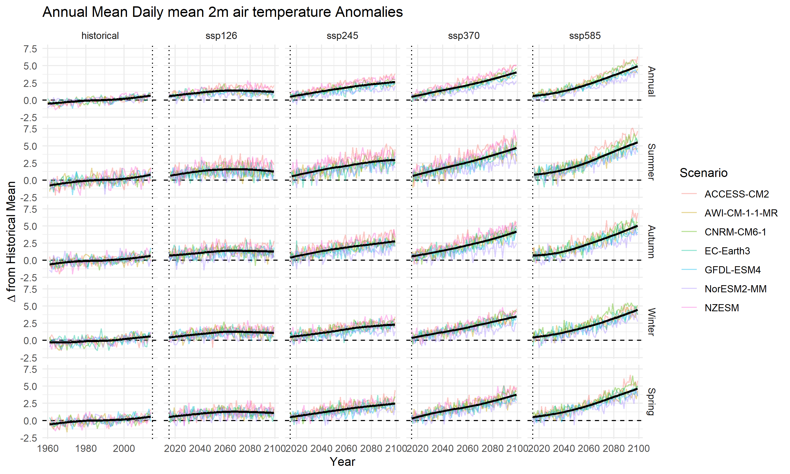

```{r}
#| label: setup
#| include: false
#| echo: false
#| cache: true

metadata <- readr::read_csv(here::here("data", "processed",
                                             "niwa_cmip6_metadata.csv"), 
                                  col_types = readr::cols())
gcm <- unique(metadata$gcm)
scenarios <- unique(metadata$scenario)
cmip_vars <- c("tas", "hurs", "pr", "rsds", "sfcWind")
var_meta <- metadata |> 
  dplyr::filter(variable %in% cmip_vars) |> 
  dplyr::distinct(variable, .keep_all = TRUE) |> 
  dplyr::mutate(units = dplyr::case_when(
    variable == "tas" ~ "°C",
    TRUE ~ units
  ))
```

After processing the CMIP6 data for the Rotorua catchment, we can visualise the results.

We present both the spatial summary and time series summary for each GCM and scenario. This allows us to inspect how the different models and scenarios represent climate variables over the catchment area.

## CMIP6 Variable Plots

### Air Temperature (2 m above ground level)

The annual mean 2 m air temperature anomalies show robust warming across all CMIP6 models and emissions scenarios, although the magnitude and rate of warming vary among models. Historical simulations indicate a modest warming of \~0.5–1 °C relative to the mid-20th-century baseline, with relatively small inter-model spread during this period.

From \~2020 onward, the scenarios diverge and uncertainties increase. Under SSP1-2.6, most models project warming that stabilises at around 1–1.5 °C above the historical mean by mid-century, with limited additional warming thereafter. The ensemble spread remains comparatively narrow in this scenario, reflecting greater model agreement under strong mitigation.

Under SSP2-4.5, temperatures continue to increase throughout the century, reaching approximately 2.5–3 °C by 2100. Inter-model variability broadens slightly over time, but the overall warming trajectory remains consistent across the ensemble.

The higher-emission scenarios show both stronger warming and greater uncertainty. SSP3-7.0 produces accelerated warming after 2050, with end-of-century anomalies near 4 °C, although individual model projections span a wider range. SSP5-8.5 exhibits the largest spread and steepest trend, with most models exceeding 5 °C by 2100, but with notable divergence in the upper tails of the ensemble.

Despite year-to-year variability and differences among models, all scenarios show statistically robust warming relative to the historical period. The increasing separation of scenario trajectories after \~2040 highlights both the importance of emissions pathway choice and the expanding uncertainty associated with long-term climate projections.



